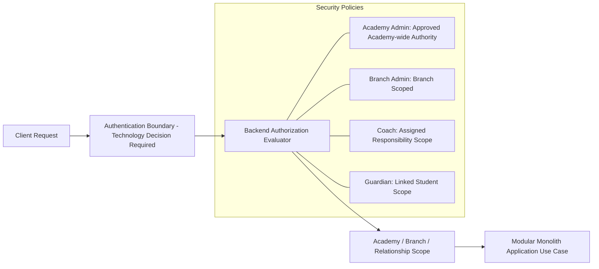

DOWNSTREAM DOCUMENT — DERIVED FROM CANONICAL BUSINESS TRUTH

This file preserves technical/downstream detail under a semantic filename. It must not override domain rules, lifecycles, decisions or open questions.

# Security Privacy Access Control

Chapter 19 — Security, Privacy & Access Control
لأنه يغلق جانب مهم جدًا قبل الدخول في SRS وArchitecture.
Chapter 19 — Security, Privacy & Access Control
19.1 Overview
Purpose

هذا الفصل يحدد متطلبات الأمان والخصوصية والتحكم في الوصول داخل نظام إدارة الأكاديمية الرياضية.

لأن النظام يحتوي على بيانات حساسة مثل:

    بيانات الطلاب.

    بيانات أولياء الأمور.

    التقييمات الرياضية.

    السجلات المالية.

    المحادثات.

    المستندات.

    بيانات الموظفين.

فالأمان ليس Feature إضافية، بل جزء أساسي من تصميم النظام.
19.2 Security Principles
SEC-001 — Least Privilege Principle

كل مستخدم يحصل فقط على الصلاحيات التي يحتاجها لتنفيذ عمله.

مثال:

المدرب:

✅ يرى الطلاب المسندين إليه.

❌ لا يرى:

    بيانات مالية.

    كل طلاب الأكاديمية.

    إعدادات النظام.

SEC-002 — Defense in Depth

الأمان يكون على عدة مستويات:

User Authentication

↓

Authorization

↓

Data Access Control

↓

Audit

↓

Monitoring

SEC-003 — Secure By Default

أي Module أو Feature جديد يبدأ بحالة:

Disabled

ولا يتم تفعيله إلا من خلال صلاحيات الإدارة.
19.3 Identity Management
User Types

النظام يدعم أنواع مستخدمين متعددة:
Internal Users

مثل:

    Owner

    Super Admin

    Admin

    Supervisor

    Coach

    Reception

External Users

مثل:

    Parent

    Student (Future)

19.4 User Account Lifecycle

كل حساب له دورة حياة:

Invited

↓

Pending Activation

↓

Active

↓

Suspended

↓

Locked

↓

Archived

19.5 Account Creation

طرق إنشاء الحساب:
Admin Creation

الإدارة تنشئ الحساب.

مثال:

ولي أمر جديد.
Invitation

النظام يرسل:

    Email.

    WhatsApp.

    SMS.

مع:

    Activation Link.

    Temporary Password.

Self Registration

مستقبلاً:

ولي الأمر يسجل بنفسه.
19.6 Authentication System
Supported Methods
Username / Password

الطريقة الأساسية.
Email Authentication

اختياري.
Phone Authentication

OTP.
Social Login (Future)

    Google.

    Apple.

19.7 Password Security
Requirements

النظام يجب أن يدعم:

    Password Hashing.

    Minimum Length.

    Complexity Rules.

    Password History.

    Password Reset.

Password Reset Flow

User Request

↓

Verification

↓

Reset Token

↓

New Password

↓

Audit Event

19.8 Multi Factor Authentication (Future)

يدعم:

    SMS OTP.

    Authenticator App.

    Email Verification.

خصوصًا:

    Admin.

    Finance Users.

    Owner.

19.9 Authorization Model

النظام يستخدم:
RBAC

Role Based Access Control

مثال:

Role:

Coach

Permissions:

view_students
create_training_report
record_attendance

19.10 Permission Structure

الصلاحية تكون:

Module.Action.Scope

مثال:

student.view.assigned

student.view.all

subscription.manage

attendance.correct

19.11 Permission Categories
View Permissions

مشاهدة البيانات.
Create Permissions

إنشاء بيانات.
Update Permissions

تعديل البيانات.
Delete Permissions

حذف أو أرشفة.
Approve Permissions

اعتماد العمليات.
Export Permissions

تصدير البيانات.
19.12 Role Examples
Super Admin

صلاحيات كاملة.
Academy Admin

يدير:

    الطلاب.

    المدربين.

    الاشتراكات.

    التقارير.

Supervisor

يدير:

    الحضور.

    التقارير اليومية.

    العمليات التشغيلية.

Coach

يدير:

    مجموعاته.

    طلابه.

    التقارير التدريبية.

Parent

يدير:

    أبنائه فقط.

19.13 Data-Level Security

الصلاحيات ليست فقط على الشاشة.

بل على مستوى البيانات.

مثال:

Coach Request:

GET /students

النظام لا يعرض كل الطلاب.

بل:

WHERE assigned_coach_id = current_user

19.14 Student Privacy

بيانات الطالب:
Public/Internal

    الاسم.

    المستوى.

    المجموعة.

Restricted

    رقم الهوية.

    الملفات الطبية.

    المستندات.

Private

    البيانات المالية.

    الملاحظات الإدارية.

19.15 Parent Privacy

ولي الأمر يرى:

فقط:

    أبنائه.

ولا يرى:

    طلاب آخرين.

    بيانات أولياء أمور آخرين.

19.16 Coach Privacy

المدرب لا يرى:

    رواتب.

    بيانات مالية.

    إعدادات النظام.

19.17 Document Security

كل ملف يخضع للصلاحيات.

مثال:

تقرير طبي:

مسموح:

    Admin.

    Authorized Supervisor.

غير مسموح:

    Coach.

19.18 API Security
Requirements

كل API يجب أن يدعم:

    Authentication.

    Authorization.

    Rate Limiting.

    Validation.

    Logging.

19.19 API Tokens

للتطبيقات المستقبلية:

    Mobile App.

    External Integration.

يدعم:

    Token Management.

    Expiration.

    Revocation.

19.20 Session Security

النظام يدعم:

    Session Expiration.

    Device Tracking.

    Logout From All Devices.

19.21 Audit Security

كل عملية حساسة تسجل.

مثل:

    تغيير صلاحية.

    تعديل تقييم.

    تعديل حضور.

    حذف بيانات.

    تصدير بيانات.

19.22 Sensitive Operations Approval

بعض العمليات تحتاج موافقة.

مثال:
Delete Student

طلب

↓

مراجعة

↓

موافقة Admin

↓

تنفيذ
Refund

طلب

↓

Approval

↓

Execution
19.23 Privacy Management
Personal Data

النظام يحتفظ بـ:

    الاسم.

    الهاتف.

    البريد.

    البيانات الأساسية.

Data Masking

في التقارير:

يمكن إخفاء:

    أرقام الهوية.

    أرقام الهاتف.

Data Export

ولي الأمر يمكن مستقبلاً طلب:

"Export My Data"
Data Removal Request

مستقبلاً:

طلب حذف البيانات.

مع مراعاة:

    الالتزامات المالية.

    السجلات القانونية.

19.24 Security Monitoring

النظام يراقب:

    Login failures.

    Suspicious activity.

    Permission changes.

    Large exports.

19.25 Activity Alerts

أمثلة:

5 Failed Login Attempts

↓

Security Alert

Admin Permission Changed

↓

Notify Owner

19.26 Backup Security

النسخ الاحتياطية يجب أن تكون:

    Encrypted.

    Access Controlled.

    Tested.

19.27 Encryption
Data In Transit

HTTPS/TLS.
Data At Rest

تشفير البيانات الحساسة.
19.28 Security Rules
SEC-RULE-001

لا يوجد User بدون Role.
SEC-RULE-002

لا يمكن تجاوز Permission من Frontend فقط.
SEC-RULE-003

كل عملية حساسة يجب تسجيلها.
SEC-RULE-004

لا يتم عرض بيانات غير مطلوبة للمستخدم.
SEC-RULE-005

Admin Actions يجب أن تكون قابلة للمراجعة.
19.29 Future Security Extensions

مستقبلاً:

    Single Sign On.

    Enterprise Identity Provider.

    Biometric Login.

    Advanced Fraud Detection.

    Security Dashboard.

    Compliance Reports.

Chapter 19 Completion Status

✅ Authentication
✅ Authorization
✅ RBAC
✅ Data Permissions
✅ Privacy
✅ Audit Security
✅ API Security
✅ Document Security
✅ Account Lifecycle
✅ Future Security Roadmap

التالي المنطقي:

---
## 📋 Document Reference Metadata
- **Document Title**: Chapter 19 — Security, Privacy & Access Control
- **Category Directory**: `10_SECURITY_COMPLIANCE`
- **Legacy Standard Label**: Enterprise Academy Platform BRD/SRS Specification v1.0 (approval not verified)
- **Target Audience**: Software Architects, Core Developers, QA Engineers, Product Managers
- **Governance Status**: Supporting or legacy source; consult `00_GOVERNANCE/SOURCE_OF_TRUTH.md` before use.
---

## 🎯 Executive Summary & Purpose
This document is a supporting downstream specification migrated from **Chapter 19 — Security, Privacy & Access Control** within the **Academy Sports Management Platform**. 
It defines functional requirements, domain rules, operational boundaries, dynamic flows, and architectural constraints necessary to implement, validate, and maintain the system.

---

## 📐 Visual Architecture & Workflow Diagram

Authentication technology is intentionally not selected here. Use the canonical Permission Catalog for authorization behavior and `../00_GOVERNANCE/TECH_STACK_LOCK.md` for the implementation gate.

---

---
## 🔗 Cross-Module References & Invariants Matrix
- **Core Domain Boundary**: `03_DOMAIN_DOCUMENTATION` (`../03_DOMAIN_DOCUMENTATION/` — legacy path superseded)
- **Business Rules Catalog**: `05_BUSINESS_RULES/Chapter_24_Business_Rules_Catalog.md` (`../05_BUSINESS_RULES/Chapter_24_Business_Rules_Catalog.md` — legacy path superseded)
- **Database Model**: `07_DATABASE_DESIGN/Chapter_27_Database_Design_&_Data_Model.md` (`../07_DATABASE_DESIGN/Chapter_27_Database_Design_&_Data_Model.md` — legacy path superseded)
- **API Specification**: `08_API_DESIGN/Chapter_28_API_Design_&_Integration_Specification.md` (`../08_API_DESIGN/Chapter_28_API_Design_&_Integration_Specification.md` — legacy path superseded)
- **Global Index Sitemap**: `INDEX.md` (`../INDEX.md` — legacy path superseded)
